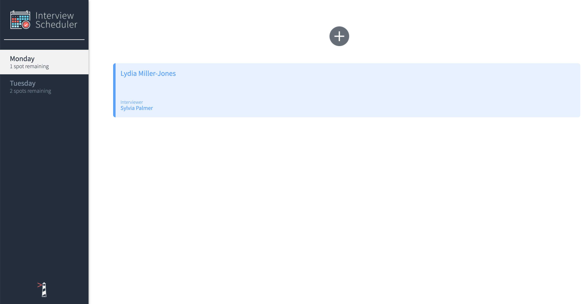
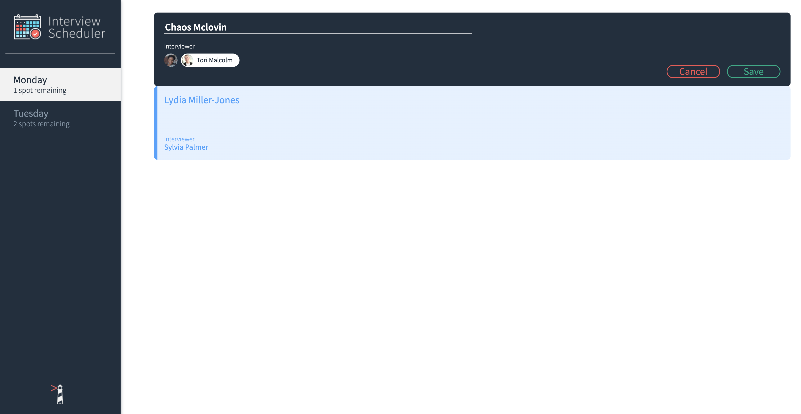

# Scheduler Project

Scheduler is a simple, single-page interview scheduler application.

## Final Product





## Dependencies

- React
- Axios
- Classnames
- Normalize.css
- react-dom
- react-scripts
- react-test-renderer
- prop-types

## Getting Started

Install the dependencies.

```bash
npm install
```

Install and run the API Server.

```
https://web.compass.lighthouselabs.ca/696c1dc0-f804-4203-a94c-a174d8ed6093
https://github.com/lighthouse-labs/scheduler-api
```

Run the app.

```bash
npm run start
```
